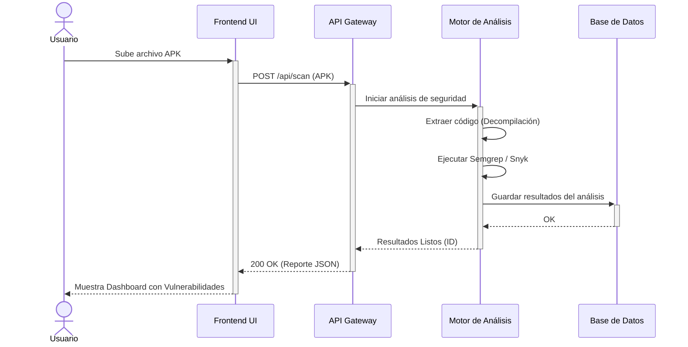
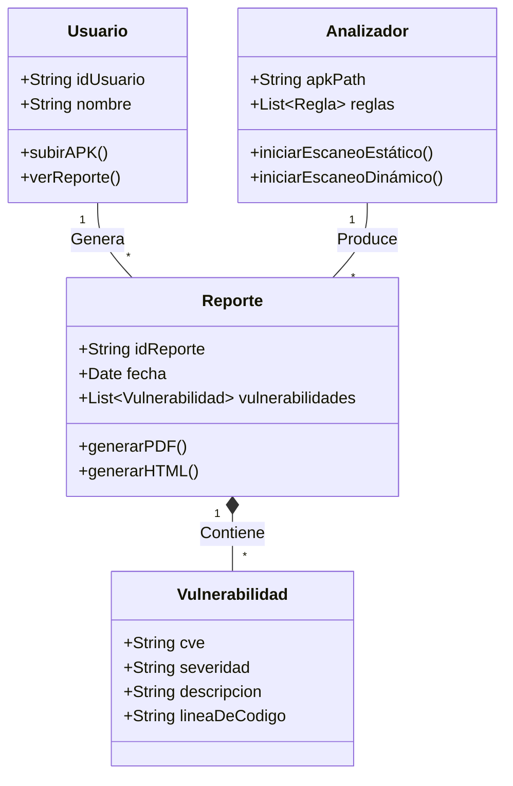
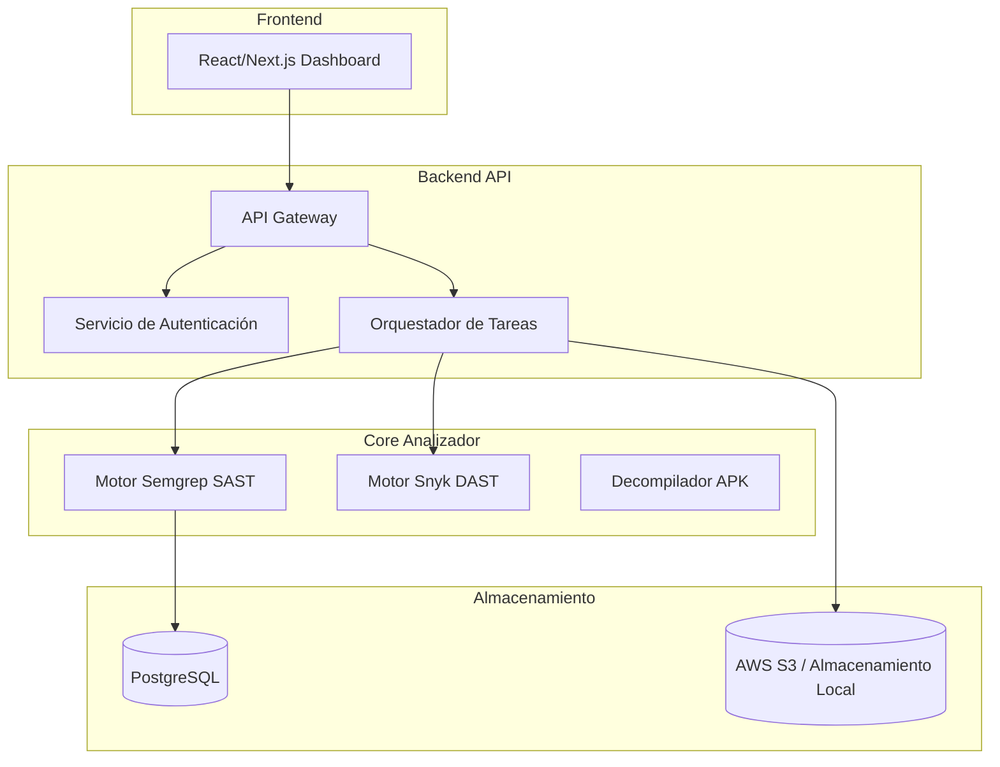

# AnzenCore – Analizador de Vulnerabilidades Móviles

Sistema diseñado para detectar y reportar vulnerabilidades en aplicaciones móviles mediante análisis estático y dinámico.

---

## 1. Diagrama de Casos de Uso

## 2. Diagrama de Secuencia (Escaneo de APK)

## 3. Diagrama de Clases

## 4. Diagrama de Componentes

