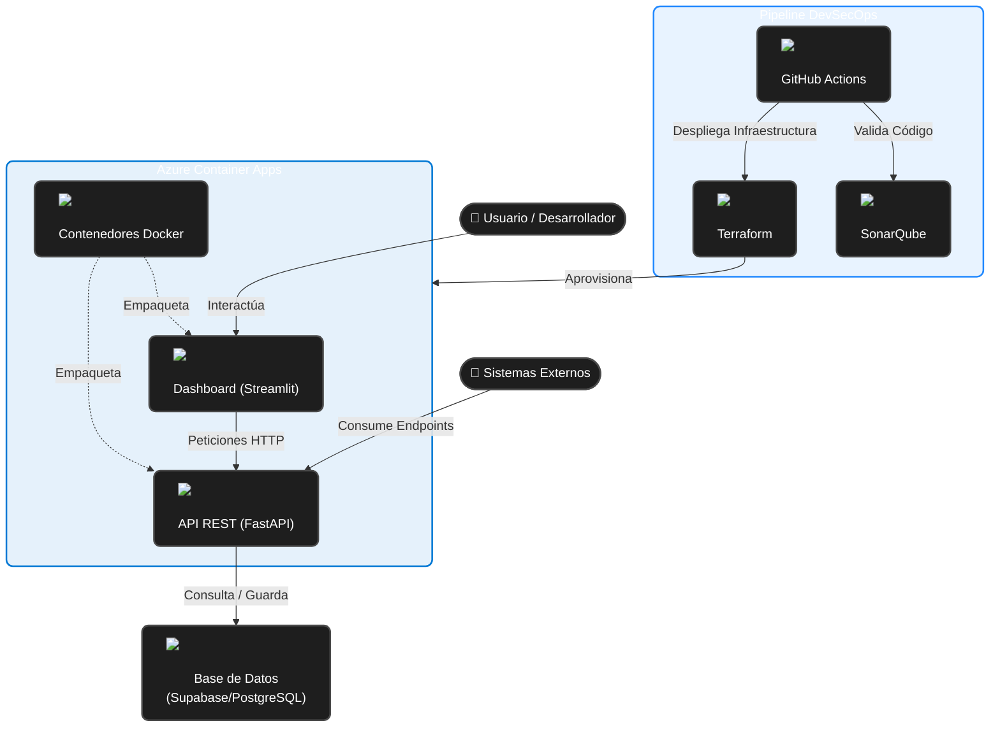
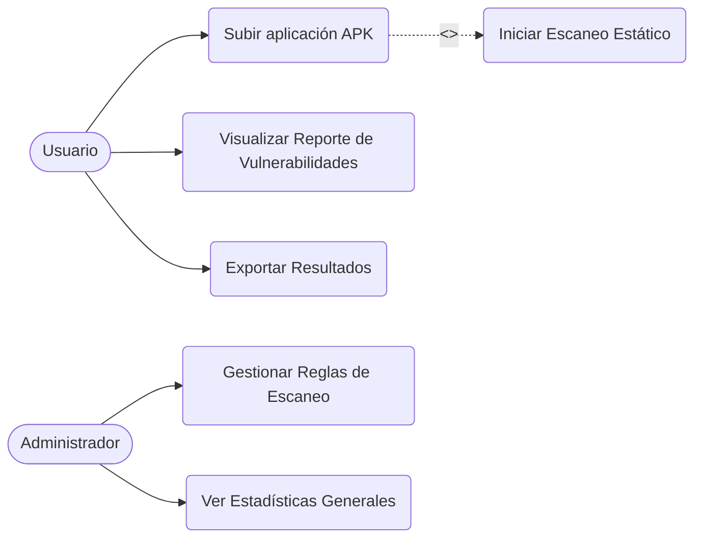
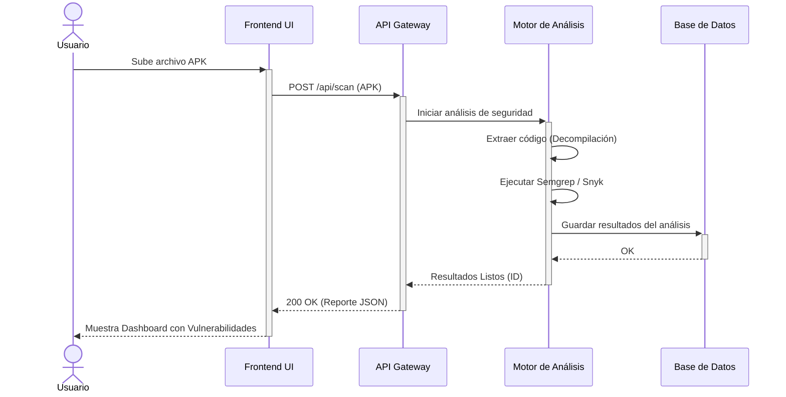
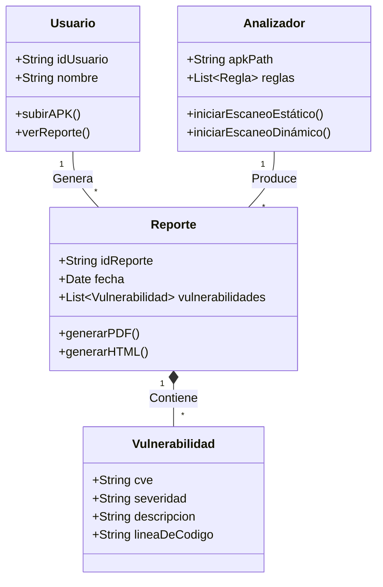
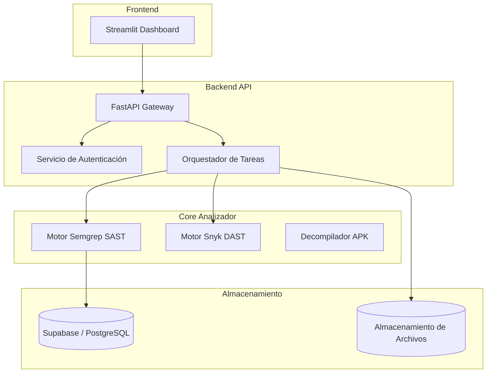
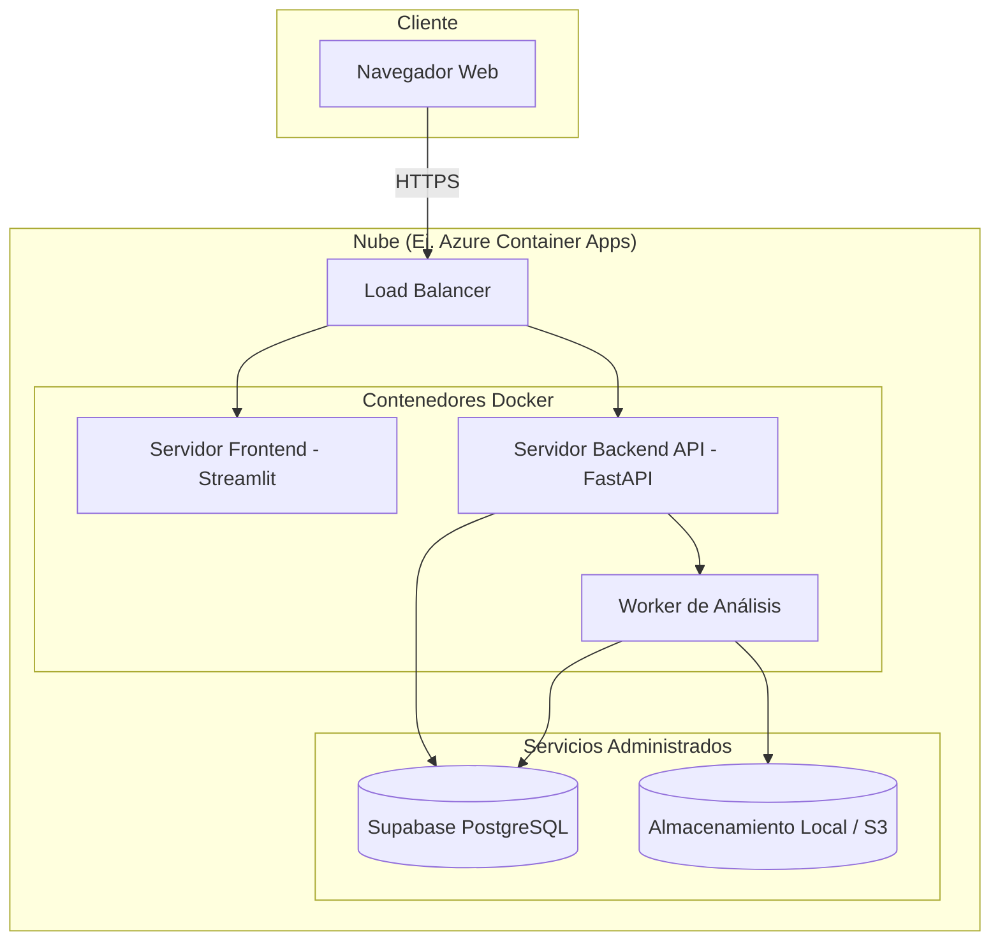

<div align="center">
  
  
  # 🛡️ AnzenCore
  **Plataforma Avanzada de Análisis de Vulnerabilidades y Calidad de Código**

  [](https://www.python.org/)
  [](https://fastapi.tiangolo.com/)
  [](https://streamlit.io/)
  [](https://supabase.com/)
  [](https://www.docker.com/)
</div>

<br/>

> **AnzenCore** es un analizador de vulnerabilidades móviles y de calidad de código. Permite analizar proyectos, realizar validaciones estáticas, registrar los hallazgos en bases de datos gestionadas de alta concurrencia y exportar reportes detallados.

**VIDEO DEMO:** https://drive.google.com/drive/folders/1yMdev7kdS-gvyCPDbb_FISKsSxXu5EmZ?usp=drive_link  
**Repositorio de la SKILL:** https://github.com/FabrizioPerezPeralta/Skill_AnzenCore.git  
**Extensión Visual Studio Code:** AnzenCore

---

## 🎯 Objetivos del Proyecto

- 🤖 **Análisis Automatizado:** Mecanismo rápido y fiable para detectar vulnerabilidades, *code smells* y métricas de complejidad en tu código fuente.
- ⚡ **Integración Continua (Stateless):** Capacidad para integrarse con microservicios externos mediante nuestra API, permitiendo analizar repositorios y carpetas sin requerir sesiones o autenticación compleja.
- 📊 **Visualización Centralizada:** Dashboard interactivo donde los desarrolladores pueden gestionar, filtrar y estudiar de cerca los hallazgos reportados.

## 💻 Stack Tecnológico

A continuación, se presentan las tecnologías que impulsan **AnzenCore**, acompañadas de sus respectivos íconos:

<details open>
<summary><b>Haz clic para contraer/expandir las tecnologías usadas</b></summary>

| Capa | Tecnologías |
| :--- | :--- |
| **Frontend / Dashboard** |  Python •  Streamlit |
| **Backend / API REST** |  Python •  FastAPI |
| **Base de Datos** |  PostgreSQL •  Supabase |
| **Infraestructura** |  Docker •  Terraform •  Azure Container Apps |
| **DevSecOps** |  GitHub Actions •  SonarQube •  Snyk |
| **Testing** |  Pytest • Behave (BDD) • Mutmut |

</details>

---

## 🧩 Arquitectura del Sistema y Tecnologías

El siguiente diagrama ilustra cómo interactúan las distintas piezas de nuestro stack tecnológico para dar vida a la plataforma.



---

## 📋 Requisitos Previos

- **Python 3.12+** instalado en el entorno.
- Una cuenta en **Supabase** (con base de datos aprovisionada).
- Archivo de configuraciones seguras (secrets) mapeados en `.streamlit/secrets.toml` y variables de entorno para la API.

---

## ⚙️ Configuración de Variables

Dependiendo del entorno de ejecución, es necesario configurar las siguientes variables:

### 1. Entorno Local (Streamlit)
Crear archivo `.streamlit/secrets.toml`:
```toml
SUPABASE_URL = "https://tu-proyecto.supabase.co"
SUPABASE_KEY = "tu_anon_key"
```

### 2. Entorno Backend (API & Contenedores)
Configurar mediante variables de sistema `.env`:
```env
SUPABASE_URL="https://tu-proyecto.supabase.co"
SUPABASE_KEY="tu_anon_key"
```

### 3. Entorno CI/CD (GitHub Actions)
```text
SONAR_TOKEN             # Integración con SonarCloud
SNYK_TOKEN              # Verificación de vulnerabilidades Snyk
SEMGREP_APP_TOKEN       # Análisis estático extendido
AZURE_CLIENT_ID         # Despliegue en Azure
AZURE_CLIENT_SECRET
AZURE_TENANT_ID
AZURE_SUBSCRIPTION_ID
```

---

## 🚀 Despliegue y Ejecución Local

### Instalación de Dependencias
```powershell
python -m venv .venv
.\.venv\Scripts\Activate.ps1
python -m pip install --upgrade pip
python -m pip install -r requirements.txt
```

### 🖥️ Arrancar el Dashboard
```powershell
streamlit run app.py
```
> URL Local: `http://localhost:8501`

### ⚙️ Arrancar la API REST
```powershell
uvicorn app.api.main:app --reload --port 8000
```
> Swagger Local: `http://localhost:8000/docs`

---

## 🐳 Ejecución vía Docker

Para ambientes aislados, el sistema provee Dockerfiles independientes.

**Dashboard:**
```powershell
docker build -f Dockerfile.dashboard -t anzencore-dashboard .
docker run -p 8501:8501 --env SUPABASE_URL=... --env SUPABASE_KEY=... anzencore-dashboard
```

**API:**
```powershell
docker build -f Dockerfile.api -t anzencore-api .
docker run -p 8000:8000 --env SUPABASE_URL=... --env SUPABASE_KEY=... anzencore-api
```

---

## ☁️ Despliegue Oficial en la Nube

El despliegue está orquestado mediante **Terraform** dirigido a la plataforma **Azure Container Apps**, garantizando escalabilidad y estabilidad.

```bash
cd infra/
terraform init
terraform fmt -recursive
terraform validate
terraform plan
terraform apply
```

---

## 🧪 Pruebas y Aseguramiento de Calidad

Ejecución unificada de pruebas unitarias y cobertura:
```powershell
pytest
pytest --cov=app --cov-report=xml
```

Pruebas orientadas al comportamiento (BDD):
```powershell
python -m behave tests\bdd
```

Pruebas de interfaz (UI):
```powershell
pytest tests/interface
```

Pruebas de Mutación *(Recomendado correr en WSL o Ubuntu)*:
```bash
python -m mutmut run --paths-to-mutate app/dashboard/services/report_export_service.py --runner "python -m pytest tests/unit/test_report_export_service.py"
```

---

## 📚 Roadmap & Documentación

- **Integración Externa:** Si deseas consumir la API desde otro servicio o frontend, revisa `API_INTEGRATION.md`.
- **Evolución del Proyecto:** Ver `docs/roadmap/roadmap.md`.

---

## 📐 Diagramas Complementarios de Arquitectura

<details>
<summary><b>1. Diagrama de Casos de Uso</b></summary>


</details>

<details>
<summary><b>2. Diagrama de Secuencia (Escaneo de APK)</b></summary>


</details>

<details>
<summary><b>3. Diagrama de Clases</b></summary>


</details>

<details>
<summary><b>4. Diagrama de Componentes</b></summary>


</details>

<details>
<summary><b>5. Diagrama de Despliegue e Infraestructura</b></summary>


</details>
